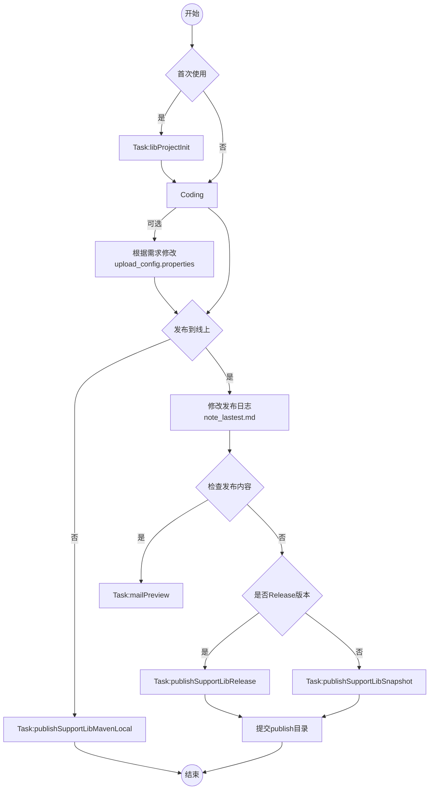

通过依赖scripts目录下的gradle脚本来提供一些公共的功能、工具类等

### 脚本介绍
* build_utils.gradle 编译工具类，提供一些方便的任务
* build_publish_app.gradle 备份发布apk及日志等功能
* build_support-lib.gradle 主要用来发布SupportLib。功能包括自动打包上传maven、发布邮件通知、记录日志等、打包时自动上传源码。
* build_publish_lib_basic.gradle 与build_support-lib.gradle相同，但在上传包时，不上传源码。
* maven_upload.gradle 管理上传lib到maven仓库的脚本。有些任务会修改upload_gradle.properties和gradle.properties
* publish_log.gradle 在版本发布任务执行中，负责记录一些发布信息。

### 接入
此工程目的是可以使用一些自定义task来加速开发工作。开发者需要根据不同需求依赖scripts下的脚本，为自己项目添加所需的task.   

### 应用场景一 : 发布support、public等Library库、自动上传并使用markdown发送邮件通知团队
###### 第1步：rootProject/build.gradle添加插件依赖
```java
repositories {
        mavenLocal()
        //依赖阿里里云
        maven { url 'http://maven.aliyun.com/nexus/content/groups/public/' }
        //添加自有依赖、并配置代码
        maven{ url 'http://xxxx' }
        jcenter()
        google()
    }

...
```
###### 第2步：projectDir/build.gradle中的配置
```java
//发布版本所用的脚本
apply from:'https://gitlab.com/android_tvkit/gradle_scripts/raw/master/scripts/build_publish_lib.gradle'
//注意，这里master分支会随着代码的提交，保持脚本是最新的。如果希望使用特定版本的脚本可以单独指定：
apply from:'https://gitlab.com/android_tvkit/gradle_scripts/raw/master/scripts/build_publish_lib.gradle'
//根据需求，配置一些一些task中的参数。
//配置生成发布日志时的参数
generatePublishLogMarkdownRelease{
    //项目参考文档地址
    reference 'http://xxx/xx/javadoc/'
    //本次发布更新点,通过更新project/publish/note_lastest.md来修改更新点

}

```
###### 第3步：根据需求配置一些Properties文件
* projectDir/upload_config.properties
```java
snapshotUrl=http\://xxxx.xxx.xxx/repository/maven-snapshots/
#配置上传的版本号
mavenVersion=1.0.1
#release版本的URL
releaseUrl=http\://xxxx.xxx.xxx/repository/maven-releases/
mavenArtifactId=script
mavenGroupId:=tv.huan.support
```
注意，此脚本不存在时，执行task:libProjectInit可自动生成此文件,并且做一些任务发布工作的准备。
最终上传到maven后引入方式为:
```java
  mavenGroupId:mavenArtifactId:mavenVersion
```
* rootDir/local.properties 配置maven上传用户、密码

```java
MAVEN_NAME=XXXX
MAVEN_PASSWORD=XXXX
```

###### 第4步：执行task
执行task:publishSupportLib*后便可将此次lib发布后并且使用邮件通知开发者,*代码Release,Snapshot,MavenLocal，分别代表上传正式版、快照版本、本地版。


###### 配置文件说明
* upload_config.properties 在上传maven档案之前，会读取此配置文件配置档案信息
  * mavenVersion 版本发布的基础版本号。
  * snapshotUrl,releaseUrl 上传maven的服务器地址
  * mavenArtifactId 名称
  * mavenGroupId 组名称  
  最终生成的maven依赖地址由mavenGroupid
###### 关于publish目录
publish目录是发布时的工作目录。在每次成功发布lib后，都会在publish下建立相关发布日志。分别位置snapshot/release俩个目录下。并且生成log_lastest文件来记录最后一次发版的日志。
publish目录下的note_lastest.md用来修改本次版本发布的更新点等信息。开发者可以根据需求，随意填写。最后的发版的日志以及通知邮件中，都会将此更新点以markdown的形式展示。

###### 发布相关Task说明
  * generatePublishRootDir
  此任务将在project下创建publish目录，并在其下创建以下文件:
    * release及snapshot俩个目录，用来记录发布日志。
    * .gitignore
    * note_lastest.md 用来编写更新点

  * libProjectInit
  此任务基于generatePublishRootDir及generateMavenProperties.当一个新创建一个lib模块时，可以执行一下此任务进行一些发布前的初始化工作。**注意如果本地存在upload_config文件，可以直接执行任务generatePublishRootDir**

  * markdownMail 使用markdown来发送邮件。
  ```java
  mailTask{
      to 'user@bftv.com' //接收人
      cc 'others1@xx.com','other2@xx.com' //抄送
      subject 'Test' //邮件标题
      contentType 'text/html;charset=utf-8' //邮件编码
      markdownFile file('/Test.MD') //编辑此源文件用来发送邮件
      from "xx@qq.com" //邮件发送地址
      userName "xx@qq.com" //邮件用户名
      password "xxxxxxxx" //邮件密码或者受权码
      serverHost "smtp.exmail.qq.com" //serverHost
      serverPort "465" //serverPort
      time new Date().toString() //时间戳
      
      //注意 ： 如果不配置发件人信息、则默认使用团队邮箱来发送邮件
  }
  
  ```
  * markdownToHtmlUtil markdown文档转成html
  ```java
    markdownToHtmlUtil{
        sourceFile file('/Test.MD')  //源文件
        outputFile file('/test_output.html') //输出文件
    }

  ```
  * updateUploadConfigXX(XX为Release/Snapshot/SnapshotMavenLocal)
    根据不同发布需求，改变upload_confing.properties文件.以下上传本地maven.并且为snapshot版本的实现。注意，此Task一般不需要手动使用。
    ```java
    task updateUploadConfigSnapshotMavenLocal(type : updateUploadConfig){
      group getProperty("taskGroup")
      release false //是否是Release版本
      mavenLocal true //是否上传到本地
    }
    ```
  * generatePublishLogMarkdownRelease/Snapshot 发布版本时，将自动在本地生成记录。发送邮件时将使用此task生成的内容。
  ```java
  generatePublishLogMarkdownRelease{
      time new SimpleDateFormat("yyyy-MM-dd HH:MM:ss").format(new Date())
      enableDoc true //是否显示reference字段
      enableGitLog false //是否显示提交记录
      changes '' //'更新点：1. XXX 2 XXXX' //这里已经弃用、通过更新project/publish/note_lastest.md来修改更新点
      gitLog '' //提交日志
      reference '' //'文档/帮助地址'
      mavenPath ''//'最终生成的maven地址'
      version ''//'版本'
      extraItemMap.put("Title:",'XXX') //添加以####(h4)展示项
      codeItemMap.put("Last commit:",commit) //添加以<code>形式展示项
      linkItemMap.put("百度:","http://baidu.com") //添加额外链接项使用此map
}
  ```
  * mailPreviewXX 预览邮件
mailPreview任务会自动执行generatePublishLogMarkdownXX任务后，将其转换成html存放于project/publish/.mail_content.html。直接打开此文件就可以进行邮件内容预览。


  * mailTask 发布版本时的最后一步，邮件通知更新点。
  ```java
  //mailTask内部字段与task:markdownMail一致。
  mailTask{
      to 'user@bftv.com' //此task默认收件人是团队所有开发人员。如果只想发给对应的人，覆写此字段。实际开发中，可以修改此地址测试邮件发送内容。
  }

  ```
  * publishSupportLibXX(XX:Release/Snapshot等) 其中publishSupportLibRelease实现如下：
  ```java
  task publishSupportLibRelease{
      uploadArchives.mustRunAfter updateUploadConfigRelease
      dependsOn generatePublishLogMarkdownRelease,uploadArchives ,markdownToHtml,mailTask
  }
  ```
  ###### supportLib开发及发布一般流程图


### 应用场景二 : 打包APK完成、自动将其备份至服务器
###### 第1步：rootProject/build.gradle添加插件依赖
参照场景一中的第1步及第3步。
###### 第2步：projectDir/build.gradle中的配置
```java
//依赖脚本。注意，使用类似tinker等插件、如果需要备份其产生的文件、则应该将此行代码置于tinker之后。
apply from:'https://gitlab.com/android_tvkit/gradle_scripts/raw/master/scripts/build_publish_app.gradle'


```
###### 第3步：projectDir/build.gradle中的配置
```java

tvkitAppPublish {
        //必配置项，应用将通过一定组织结构将Apk自动备份至该目录。
        //通过此方法实现了由jenkins打包后自动备份。
        apkBackupPath "${project.projectDir}/backupApk" 
        //可选 此配置指定的文件或者文件夹将被整个复制到此应用备份目录下。可支持配置多个文件。
        appDirAttachFiles "${project.projectDir}/releasedApk"
         //可选 此配置指定的文件或者文件夹将被整个复制到备份的Build目录下。可支持配置多个文件。
        buildDirAttachFiles "${project.rootDir}/CHANGELOG.md"
}
```
###### 第4步：执行assemble相关Task来打包。打包完毕后、将自动开始备份。